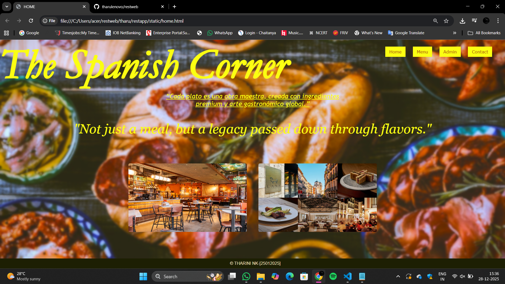
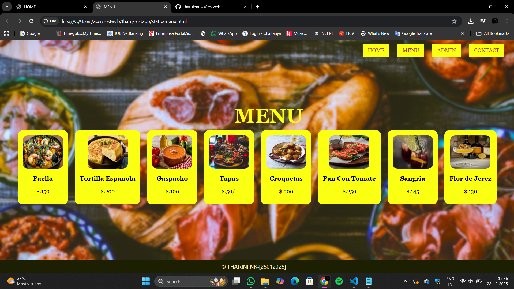
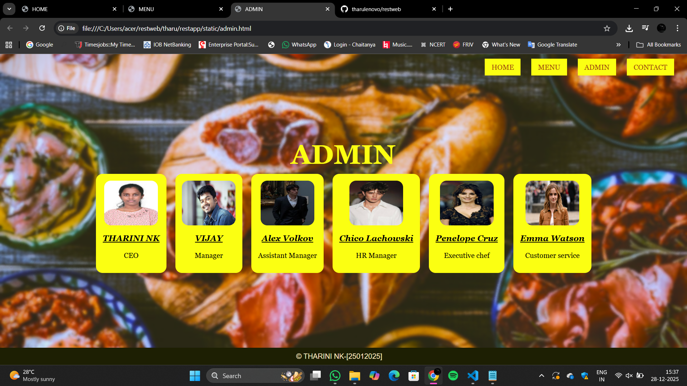
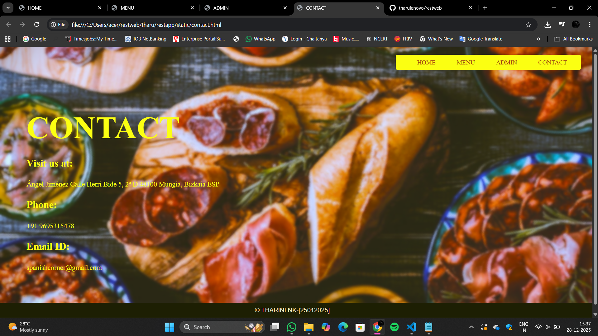

# Ex.06 Restaurant Website
## Date: 28-12-2025

## AIM:
To develop a static Restaurant website to display the food items and services provided by them.

## DESIGN STEPS:

### Step 1:
Requirement collection.

### Step 2:
Creating the layout using HTML and CSS.

### Step 3:
Updating the sample content.

### Step 4:
Choose the appropriate style and color scheme.

### Step 5:
Validate the layout in various browsers.

### Step 6:
Validate the HTML code.

### Step 7:
Publish the website in the given URL.

## PROGRAM:
```
Home.html
<html>
    <head>
        <title>
            HOME
        </title>
        <link rel="stylesheet" href="home.css">
    </head>
    <body>
        <div class="heading">
            <h1><i><b>The Spanish Corner</b></i></h1>
        </div>
        <div class="quotes">
            <p><i>"Not just a meal, but a legacy passed down through flavors."</i></p>
            </p>
        </div>
        <div class="line">
         <u><i>“Cada plato es una obra maestra, creada con ingredientes premium y arte gastronómico global.”</i></u>
        </div>
        <div class="header">
            <a href="rest.html">Home</a>
            <a href="menu.html">Menu</a>
            <a href="admin.html">Admin</a>
            <a href="contact.html">Contact</a>
        </div>
        <div class="img">
        
        
        </div>
        <div class="footer">
             &copy; THARINI NK-[25012025]
        </div>
    </body>
</html>

home.css
body{
    background-image: url("Untitled\ design.png");
    background-repeat: no-repeat;
    background-position: center;
    background-size: cover;
    margin: 0;
}
.heading{
    position: absolute;
    top: -102px;
    left: 0;
    right: 0;
    text-align: left;
    font-family: Garamond, serif;  
    font-size: 80px;
    font-weight: bolder;
    color:rgb(251, 255, 18); 
}
.line{
    position: absolute;
    top: 200px;
    left: 0;
    right: 0;
    width: 700px;
    margin: auto;
    text-align: center;
    font-family: "Trebuchet MS", sans-serif;
    font-size: 25px;
    color: rgb(251, 255, 18);
}
a:hover{
    background-color:PIN;
    color:WHITE;
}
.quotes{
    position: absolute;
    top: 260px;
    left: 0;
    right: 0;
    text-align: center;
    font-family: Georgia, serif;
    font-size: 50px;
    font-style: italic;
    color: rgb(251, 255, 18); 
}
.header{
    position: fixed;
    top: 30px;
    right: 50px;
    font-family: Verdana, sans-serif; 
    font-size: 22px;
    color:rgb(251, 255, 18);
}
.header a {
    text-decoration: none;
    margin-left: 20px;
    padding: 10px 15px;
    background-color: rgb(251, 255, 18);
    color:rgb(158, 66, 16);
    font-size: 16px;
}
.img{
    position: relative;
    top: 450px;
    text-align: center;
}
.img img{
    width: 450px;
    height: 260px;
    margin: 20px;
    border-radius: 5px;
}
.footer{
    position: fixed;
    bottom: 0;
    width: 100%;
    background-color: rgb(29, 31, 3); 
    color: rgb(249, 233, 193); 
    text-align: center;
    font-family: Arial, sans-serif; 
    padding: 10px;
}

Menu.html
<html>
<head>
    <title>MENU</title>
    <link rel="stylesheet" href="menu.css">
</head>
<body>
    <div class="nav">
        <a href="home.html">HOME</a>
        <a href="menu.html">MENU</a>
        <a href="admin.html">ADMIN</a>
        <a href="contact.html">CONTACT</a>
    </div>
    <h1 class="menu">MENU</h1>
    <div class="container">
        <div class="list">
            
            <h3>Paella</h3>
            <p>$.150</p>
        </div>
        <div class="list">
            
            <h3>Tortilla Espanola</h3>
            <p>$.200</p>
        </div>
        <div class="list">
            
            <h3>Gaspacho</h3>
            <p>$.100</p>
        </div>
        <div class="list">
            
            <h3>Tapas</h3>
            <p>$.50/-</p>
        </div>
        <div class="list">
            
            <h3>Croquetas</h3>
            <p>$.300</p>
        </div>
        <div class="list">
            
            <h3>Pan Con Tomate</h3>
            <p>$.250</p>
        </div>
        <div class="list">
            
            <h3>Sangria</h3>
            <p>$.145</p>
        </div>
        <div class="list">
            
            <h3>Flor de Jerez</h3>
            <p>$.130</p>
        </div>
    </div>
   <div class="footer">
             &copy; THARINI NK-[25012025]
        </div>
</body>
</html>

menu.css
body{
    background-image: url("Untitled\ design.png");
    background-size: cover;
    background-position: center;
    font-family: Georgia, serif;
}


.nav{
    position: absolute;
    top: 20px;
    right: 30px;
}

.nav a{
    text-decoration: none;
    margin-left: 20px;
    padding: 10px 15px;
    background-color: rgb(251, 255, 18);
    color:rgb(158, 66, 16);
    font-size: 16px;
}


.menu{
    position: absolute;
    top: 150px;
    text-align: left;
    left: 700px;
    font-size: 60px;
    color: rgb(251, 255, 18);
}


.container{
    position: relative;
    top: 260px;
    display: flex;
    justify-content: center;
    gap: 20px;
}


.list{
    background-color:rgb(251, 255, 18);
    padding: 15px;
    text-align: center;
    border-radius: 15px;
}

.list img{
    width: 120px;
    height: 100px;
    border-radius: 15px;
}
.footer{
    position: fixed;
    bottom: 0;
    width: 100%;
    left: -20px;
    background-color: rgb(29, 31, 3); 
    color: rgb(249, 233, 193); 
    text-align: center;
    font-family: Arial, sans-serif; 
    padding: 10px;
}

Admin.html
<html>
<head>
    <title>ADMIN</title>
    <link rel="stylesheet" href="admin.css">
</head>
<body>
    <div class="nav">
        <a href="home.html">HOME</a>
        <a href="menu.html">MENU</a>
        <a href="admin.html">ADMIN</a>
        <a href="contact.html">CONTACT</a>
    </div>
    <h1 class="admin">ADMIN</h1>
    <div class="menu">
        <div class="list">
            
            <h3><i><u>THARINI NK</u></i></h3>
            <p>CEO</p>
        </div>
        <div class="list">
            
            <h3><i><u>VIJAY</u></i></h3>
            <p>Manager</p>
            
        </div>
        <div class="list">
            
            <h3><i><u>Alex Volkov</u></i></h3>
            <p> Assistant Manager</p>
        </div>
        <div class="list">
            
            <h3><i><u>Chico Lachowski</u></i></h3>
            <p>HR Manager</p>
        </div>
        <div class="list">
            
            <h3><i><u>Penelope Cruz</u></i></h3>
            <p>Executive chef</p>
        </div>
        <div class="list">
            
            <h3><i><u>Emma Watson</u></i></h3>
            <p>Customer service</p>
        </div>
    </div>
    <div class="footer">
             &copy; THARINI NK-[25012025]
        </div>
</body>
</html>

admin.css
body{
    background-image: url("Untitled\ design.png");
    background-size: cover;
    background-position: center;
    font-family: Georgia, serif;
}


.nav{
    position: absolute;
    top: 20px;
    right: 30px;
}

.nav a{
    text-decoration: none;
    margin-left: 20px;
    padding: 10px 15px;
    background-color: rgb(251, 255, 18);
    color:rgb(158, 66, 16);
    font-size: 16px;
}


.admin{
    position: absolute;
    top: 150px;
    text-align: center;
    left: 650px;
    font-size: 60px;
    color:rgb(251, 255, 18);
}


.menu{
    position: relative;
    top: 260px;
    display: flex;
    justify-content: center;
    gap: 20px;
}


.list{
    background-color:rgb(251, 255, 18);
    padding: 15px;
    text-align: center;
    border-radius: 15px;
}

.list img{
    width: 120px;
    height: 100px;
    border-radius: 15px;
}
 

.footer{
      position: fixed;
    bottom: 0;
    width: 100%;
    left: -20px;
    background-color: rgb(29, 31, 3); 
    color: rgb(249, 233, 193); 
    text-align: center;
    font-family: Arial, sans-serif; 
    padding: 10px;
}

Contact.html
<html>
<head>
    <title>CONTACT</title>
    <link rel="stylesheet" href="contact.css">
</head>
<body>
    <div class="nav">
        <a href="home.html">HOME</a>
        <a href="menu.html">MENU</a>
        <a href="admin.html">ADMIN</a>
        <a href="contact.html">CONTACT</a>
    </div>
    </div>
    <div class="contact">
        <h1>CONTACT</h1>
        <div class="Details">
            <h2>Visit us at:</h2>
            <p>
                Ángel Jiménez
                Calle Herri Bide 5, 2º D
                48100 Mungia, Bizkaia ESP
            </p>

            <h2>Phone:</h2>
            <p>+91 9695315478</p>

            <h2>Email ID:</h2>
            <p>spanishcorner@gmail.com</p>
        </div>
    </div>
    <div class="footer">
             &copy; THARINI NK-[25012025]
        </div>
</body>
</html>

contact.css
body {
    height: 100h;
    background-image: url("Untitled\ design.png");
    background-size: cover;
    background-position: center;
    color: rgb(251, 255, 18);
}

.nav{
    position: absolute;
    top: 20px;
    right: 30px;
    background-color:rgb(251, 255, 18);
    padding: 10px 20px;
    border-radius: 4px;
}

.nav{
    position: absolute;
    top: 20px;
    right: 30px;
}

.nav a{
    text-decoration: none;
    margin-left: 20px;
    padding: 10px 15px;
    background-color: rgb(251, 255, 18);
    color:rgb(158, 66, 16);
    font-size: 16px;
}   
.contact {
    padding: 100px 60px;
}

.contact h1 {
    font-size: 80px;
    color: rgb(251, 255, 18);
    margin-bottom: 30px;
}

.details h2 {
    font-size: 26px;
    margin-top: 20px;
}

.details p {
    font-size: 18px;
    line-height: 2;
    margin-top: 5px;
}
.footer{
    position: fixed;
    bottom: 0;
    width: 100%;
    left: -20px;
    background-color: rgb(29, 31, 3); 
    color: rgb(249, 233, 193); 
    text-align: center;
    font-family: Arial, sans-serif; 
    padding: 10px;
}
```

## OUTPUT:








## RESULT:
The program for designing software company website using HTML and CSS is completed successfully.
